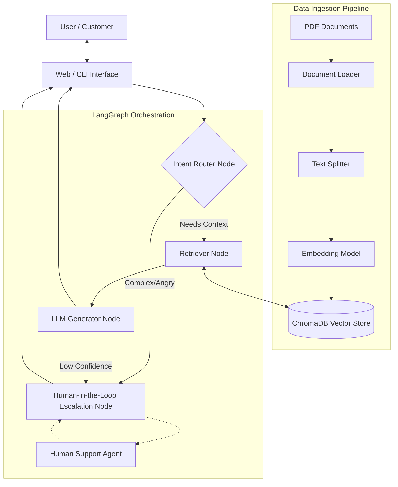

# Deliverable 1: High-Level Design (HLD)
**Project**: RAG-Based Customer Support Assistant

## 1. System Overview
### Problem Definition
Given the overwhelming volume of routine customer support queries, organizations face increased latency in support response times and higher operational costs. Traditional hardcoded chatbots lack the contextual intelligence required to handle nuanced inquiries found within dynamic knowledge bases (such as instruction manuals, policy documents, or FAQs).

### Scope of the System
This system implements a Retrieval-Augmented Generation (RAG) assistant designed to ingest large PDF knowledge bases, index their content conceptually into a vector database, and utilize a Large Language Model (LLM) to form factually correct, highly relevant replies. Crucially, the system features a LangGraph workflow that guarantees a strict logic flow to detect intents and explicitly supports Human-in-the-Loop (HITL) escalation for questions that exceed the bot's confidence constraints or fall out of bounds of the embedded knowledge base.

## 2. Architecture Diagram (Mandatory)

## 3. Component Description
- **Document Loader**: Reads raw data from PDFs and formats it into plain string contexts.
- **Chunking Strategy**: A generic Recursive Character Text Splitter is utilized to divide documents into logical, semantic chunks (e.g., 1000 characters with 100 characters mathematical overlap) to preserve context continuity.
- **Embedding Model**: Text input is vectorized using Google's `gemini-embedding-2-preview` model, ensuring high-dimensional semantic alignment.
- **Vector Store**: A ChromaDB instance persistently stores vector representations alongside metadata. The storage path is forced to `PROJECT_ROOT/chroma_db` for portability.
- **Retriever**: Queries the vector database using Cosine Similarity. We pull the top-3 chunks to provide dense but concise context.
- **LLM**: Google's `gemini-2.5-flash` model handles conversational inference, chosen for its 1M+ token context window and extreme speed.
- **Graph Workflow Engine**: **LangGraph** orchestrates the sequence (Input -> Processing -> Output), enforcing state-based execution limits and cyclic evaluations.
- **Routing Layer**: A heuristic-sentiment classifier that segregates "Standard Support" from "Immediate Escalation."
- **HITL Module**: A dedicated State Interrupt node. It pauses programmatic execution using a `MemorySaver` checkpointer, allowing human intervention.

## 4. Data Flow
1. **Document Ingestion Layer**: PDF -> Loader extracts text -> Text gets split into chunks -> Each chunk gets embedded into a dense vector -> Chunks and Vectors are ingested into ChromaDB.
2. **Query Lifecycle**: User provides an input query -> The UI passes state to the LangGraph Input Node -> Intent routing classifies the string -> The query gets embedded -> ChromaDB retrieves top *k* chunks -> **LLM** reads prompt + retrieved chunks -> Formulates Response -> Output passes through confidence checks limit -> Passed to UI. 

## 5. Technology Choices
- **Why ChromaDB**: Lightweight and embeddable. It avoids the latency and cost of cloud vector stores like Pinecone during the internship phase.
- **Why LangGraph**: It provides "Cycle Management" and "Check-pointing" which standard LangChain lacks. This is essential for the Human-in-the-Loop requirement.
- **LLM Choice**: **Google Gemini 2.5** was chosen for its class-leading speed and seamless integration with Google GenAI embeddings.

## 6. Scalability Considerations
- **Handling Large Documents**: Utilizing purely in-memory ingestion strategies creates memory bloat. A persistent file system-backed ChromaDB coupled with asynchronous chunking pipelines is required as file loads increase.
- **Increasing Query Load**: Moving vector computations from local instances to dedicated standalone inference servers ensures minimal latency. Fast-tracking cache layers (e.g., Redis Semantic Caching) eliminates DB queries for perfectly identical historical queries.
- **Latency Concerns**: Setting strict timeouts on Document Retrieval and enforcing asynchronous generative streaming guarantees the user perceives immediate responsiveness, mitigating typical "loading..." fatigue inherent to long-document RAG operations.
